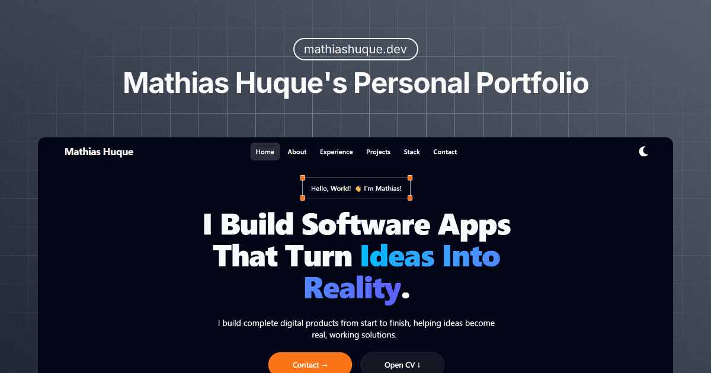

# Portfolio — mathiashuque.dev



Personal portfolio website for **Mathias Huque**.

Live: [https://www.mathiashuque.dev/](https://www.mathiashuque.dev/)

---

## Overview

A single-page portfolio featuring sections for **About**, **Experience**, **Projects**, **Stack**, and **Contact**.

Includes:

* Theme toggle (light/dark)
* CV access
* Animated UI elements using Motion
* Contact section with direct email + social links

---

## Tech Stack

* **Next.js 16** (App Router)
* **React 19**
* **TypeScript**
* **Tailwind CSS v4** (+ `tailwindcss-animated`)
* **Motion / Framer Motion**
* **Lucide React / React Icons**
* **Resend** (email handling)

---

## Getting Started

### Prerequisites

* Node.js (LTS recommended)
* npm (or pnpm/yarn/bun)

### Install

```bash
npm install
```

### Run locally

```bash
npm run dev
```

Open [http://localhost:3000](http://localhost:3000)

### Typecheck

```bash
npm run typecheck
```

### Lint

```bash
npm run lint
```

### Production Build

```bash
npm run build
npm run start
```

---

## Deployment

This project is deployed using **Vercel**.

Deploy via CLI:

```bash
npm run deploy
```

Or connect the repository directly in Vercel and use the default Next.js build configuration.

---

## Environment Variables

If using Resend for contact functionality, you may need:

```
RESEND_API_KEY=your_api_key
CONTACT_TO_EMAIL=your_email@example.com
```

Check the project source for the exact variable names used.

---

## Project Structure (Typical)

```txt
.
├─ public/            # Static assets
├─ src/
│  ├─ app/            # App Router pages and layout
│  ├─ components/     # Reusable UI components
│  ├─ lib/            # Utilities and helpers
│  └─ styles/         # Global styles
├─ package.json
└─ README.md
```

---

## License

Choose one:

* MIT License (recommended for open portfolio code)
* Or "All rights reserved" if you prefer restricted usage
